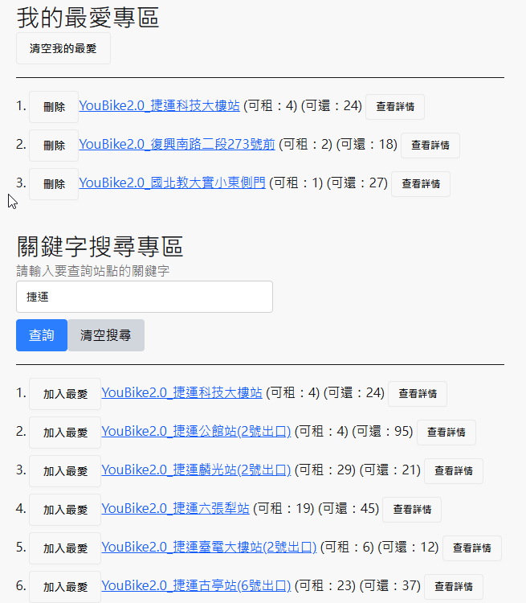

# Vue 3 + Vite

# 1. 使用 axios get ubike 資訊 list 使用 ref 存入狀態
# 2. 列出 ubike 列表 
#      (1) 左側加入 "加入最愛" 的鈕 連結 作業1 的功能 (local storage 保存我的最愛)
#      (2) 右側加入 "查看詳情" 的鈕 連續點擊 可以 打開 收起 打開 收起
# 3. 於搜索框輸入文字後 按 enter 或是 "查詢" 鈕 可以 filter get 到的 ubike list
# 4. 於 "我的最愛專區" 只會顯示 已加入我的最愛的站點資訊 可刪 可查看詳情

